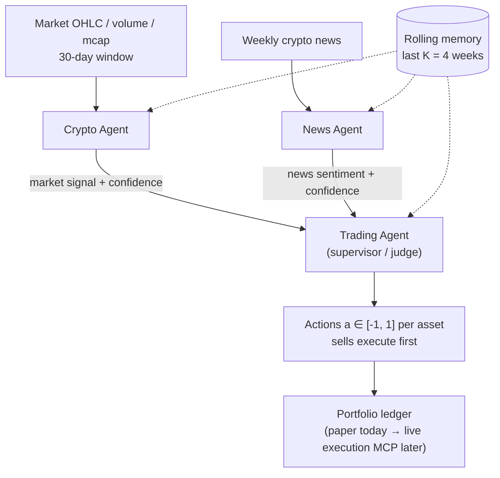
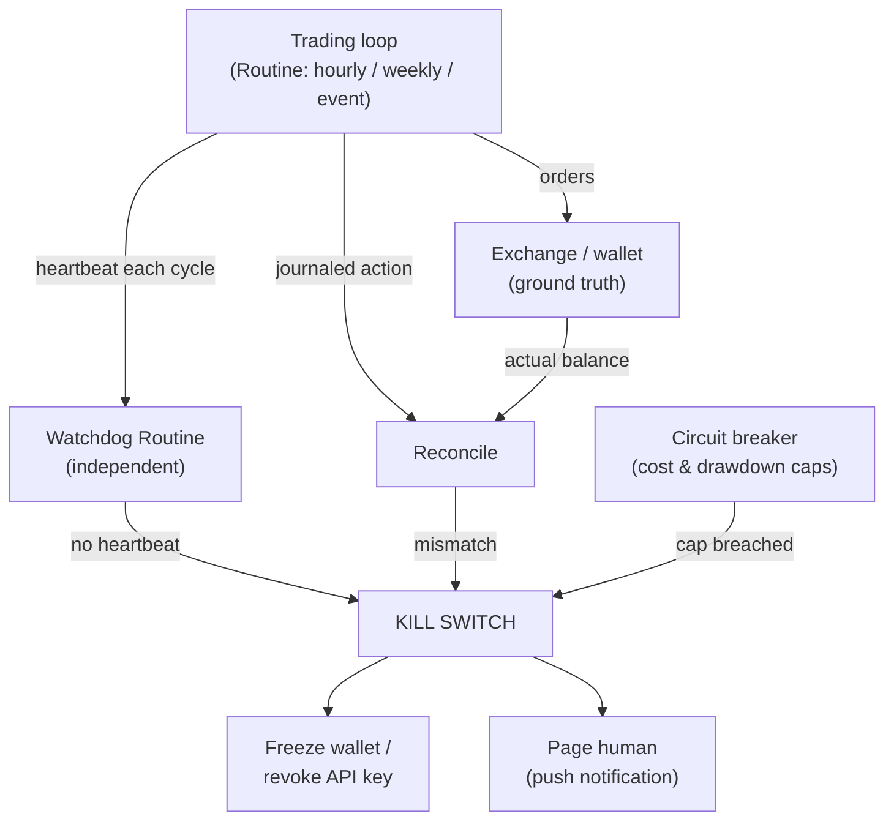

# Crypto Desk Research

**Status:** Research only — no implementation code in this repo yet.
**Repo state at time of writing:** empty (fresh branch, zero prior commits).
**Compiled:** September 1, 2026, by Claude Code, across several research passes.
**Mandate:** turn this repository into a Claude-native, 24/7, fully autonomous, aggressively-postured multi-agent crypto trading and portfolio-management desk — grounded in [arXiv:2501.00826v3](https://arxiv.org/abs/2501.00826), the current Claude Skills/MCP/Managed Agents ecosystem, real-world evidence of how LLMs actually trade, and how to inject trading knowledge directly into Claude.

> This document consolidates every finding from the research phase into one file, per request. An earlier, more visually-designed pass of the same research also exists as a published HTML artifact ("Crypto Desk Blueprint"); this file is the complete, self-contained, plain-text version, extended with additional research (live trading-competition evidence, backtesting frameworks, position-sizing math, and additional strategy families).

---

## Table of contents

1. [Executive summary](#1-executive-summary)
2. [The blueprint paper — arXiv:2501.00826v3](#2-the-blueprint-paper--arxiv250100826v3)
3. [Real-world evidence: competitions and live trials](#3-real-world-evidence-competitions-and-live-trials)
4. [Prior art already built on Claude](#4-prior-art-already-built-on-claude)
5. [Claude-native tooling map](#5-claude-native-tooling-map)
6. [Managed Agents — the first-party production path](#6-managed-agents--the-first-party-production-path)
7. [Recommended architecture for this repo](#7-recommended-architecture-for-this-repo)
8. [Running 24/7 — the full-autonomy layer](#8-running-247--the-full-autonomy-layer)
9. [Risk, safety, custody & position sizing](#9-risk-safety-custody--position-sizing)
10. [Evaluation plan & backtesting frameworks](#10-evaluation-plan--backtesting-frameworks)
11. [Phased roadmap](#11-phased-roadmap)
12. [Gaps & what couldn't be verified](#12-gaps--what-couldnt-be-verified)
13. [Signal sources: social & on-chain intelligence](#13-signal-sources-social--on-chain-intelligence)
14. [Statistical rigor: what the numbers really support](#14-statistical-rigor-what-the-numbers-really-support)
15. [Multi-agent trust, consensus & architecture extensions](#15-multi-agent-trust-consensus--architecture-extensions)
16. [Execution quality: order slicing](#16-execution-quality-order-slicing)
17. [Sources](#17-sources)

---

## 1. Executive summary

The repository is a clean slate. That's good news — there's no legacy architecture to fight, and the repo's own name is, almost word for word, the title of a real, recent paper that ran the exact experiment this project wants to run, including Claude as one of three tested model backbones.

**Headline numbers from that paper:**

| Metric | Value |
|---|---|
| Best config's cumulative return (52-week 2025 backtest) | **+133.52%** |
| Sharpe ratio, same config (Hierarchical + Skill) | **1.50** |
| Claude's mean return across all 16 architecture×capability setups | **+33.0%** — highest of the 3 backbones tested |
| Debate + Skill's bull-market return (this build's aggressive target) | **+290.96%** |

**Top-line recommendations:**

1. **Build the paper's three-agent system natively on Claude** — a Crypto Agent and a News Agent reporting to a Trading Agent orchestrator — rather than adopting a heavyweight external framework. A near-identical pattern already runs in production as a Claude Code plugin (`crypto-claude-desk`, §4).
2. **Validate on Hierarchical + Skill, then run live on Debate + Skill.** Hierarchical+Skill is the paper's steadiest, easiest-to-build config; Debate+Skill is its highest-upside config — the trade-off an aggressive posture is explicitly asking for (§7, §9).
3. **Reuse the MCP connectors already available** — CoinGecko, SQD, Twelve Data — instead of standing up new data plumbing, and lean on genuinely free sources wherever possible (§5).
4. **"24/7 and fully automated" is an infrastructure problem as much as a strategy problem.** Crypto never closes; Anthropic's own Managed Agents platform (scheduled deployments, hard-dollar budgets, vaulted credentials, persistent memory) is purpose-built for exactly this (§6, §8).
5. **Automate the safety net, not just the trading.** A dead-man switch, an out-of-band kill switch, and reconciling every trade against ground truth are what let "Claude does everything" survive a bad day without a human approving each trade (§8, §9).
6. **Risk posture: aggressive, per direction.** Concentrated conviction bets, leverage on the table, wide drawdown tolerance — with circuit breakers re-purposed as malfunction detectors, not risk limiters. The market risk is the point; a bug or a drained key isn't (§9).
7. **Treat the paper's numbers, and every other single data point in this document (including live-competition results), as hypotheses to verify on this project's own reproduced harness — not guarantees** (§3, §10).
8. **Extend signal sources deliberately, and stay statistically honest about the result.** Social sentiment (LunarCrush/Santiment) and on-chain composite signals (MVRV/SOPR/exchange netflow) are well-evidenced additions beyond the paper's single news source — but a 2026 benchmark found only 32.5% of LLM-driven portfolio evaluations beat a naive equal-weight baseline, and this project's own eventual best config deserves a *deflated* Sharpe ratio, not just its raw headline number (§13–14).

---

## 2. The blueprint paper — arXiv:2501.00826v3

**Citation:** Luo, Feng, Xu, Tasca & Liu (UCL / NTU / Exponential Science), *"LLM-Powered Multi-Agent System for Automated Crypto Portfolio Management,"* [arXiv:2501.00826v3](https://arxiv.org/abs/2501.00826). This is the paper the project brief linked, and its title is essentially this repository's name — it is the direct blueprint, not background reading.

### 2.1 The three agents

| Agent | Reads | Produces | Role |
|---|---|---|---|
| **Crypto Agent** | 30-day price/volume/market-cap per asset, plus skill signals when enabled | Per-asset directional signal, confidence, rationale | Market-dynamics analyst — the alpha engine (see ablation, §2.4) |
| **News Agent** | Prior week's Cointelegraph articles | Market-wide sentiment + per-mentioned-asset signal | Risk dampener, not a return driver |
| **Trading Agent** | Both agents' reports + portfolio state (cash, holdings, unrealized P&L) + memory | Trading actions *a* ∈ [−1, 1] per asset | Supervisor/judge — reconciles conflicts, caps concentration, sizes by conviction |



### 2.2 Four capability configurations

Each agent can also run at one of four **capability levels** — how much reasoning scaffolding it gets before producing its structured output:

| Config | Mechanism | What the paper found |
|---|---|---|
| Zero-shot | Direct input → structured output, no scaffolding beyond memory + ReAct | Capability floor |
| Chain-of-thought | Forced `<reasoning>` block before the JSON | Best bear-market drawdown control — more deliberate sizing |
| RAG | 11-dim scale-invariant feature vector, cosine top-K=3 historical analogues, no lookahead | Lowest volatility of any strategy (40.4%) — but worst upside capture |
| **Skill-augmented** | 4 rule-based indicators (SMA7, SLMA golden-cross, MACD histogram, Bollinger mean-reversion) collapsed into a 0–4 composite bullish count injected into the prompt | **Best returns in every one of the three architectures — the outright winner** |

### 2.3 Three communication architectures

How much the Crypto and News Agents influence each other before the Trading Agent decides:

| Architecture | Mechanism | Character |
|---|---|---|
| **Hierarchical** | Single-pass reports, no cross-talk; Trading Agent is a supervisor | Steadiest — best full-period Sharpe (1.50), shallowest bear drawdown among top performers |
| **Collaborative** | R=1 mutual refinement round before Trading Agent integrates | Middle ground |
| **Debate** | R=2 adversarial rounds — each side must challenge the other and cite evidence; Trading Agent becomes a judge over the full transcript | Highest raw upside (+290.96% bull-market), also the deepest bear-market drawdown (−47.3%) — conviction amplified both ways |

All configurations share: a **rolling memory** of each agent's last K=4 weekly outputs (prepended reverse-chronological), and a **ReAct-style prompt** interleaving reasoning with the structured action.

**Backtest setup:** 52 ISO weeks across calendar-year 2025, top-15 L1 cryptocurrencies by January-2025 market cap (BTC, ETH, BNB, XRP, SOL, TRX, ADA, BCH, HYPE, XMR, ZEC, LTC, SUI, AVAX, HBAR), $100k starting book, 0.1% transaction cost per side, temperature 0.0. The window was chosen specifically because it falls after all three backbones' training cutoffs (GPT-4o: Oct 2023, GPT-5: Sep 2024, Claude Sonnet 4.5: Jan 2025), so none of them could have memorized the answer.

### 2.4 Headline results (GPT-4o backbone, full 52-week period)

| Strategy | Cum. return | Sharpe | Max drawdown | Win rate |
|---|---:|---:|---:|---:|
| BTC buy-and-hold | −3.4% | 0.09 | −29.7% | 46.2% |
| Mcap-weighted hold (15 assets) | −4.5% | 0.10 | −31.3% | 50.0% |
| Best deep-learning forecaster (TimesNet, of 5 tested) | +83.4% | 1.21 | −32.1% | 55.8% |
| Best single-agent LLM (chain-of-thought) | −8.8% | 0.01 | −34.5% | 46.2% |
| Multi-agent, Debate + Skill | +110.0% | 1.31 | −44.6% | 59.6% |
| **Multi-agent, Hierarchical + Skill** | **+133.5%** | **1.50** | −39.3% | 59.6% |

### 2.5 Ablation study — what actually drives the result

Removing one component from the Hierarchical/Zero-shot reference (GPT-4o, full period):

| Component removed | Δ Cum. return | Δ Volatility | Δ Sharpe | Reading |
|---|---:|---:|---:|---|
| Memory (K=4 window) | −11.5 pp | +3.4 pp | −0.17 | Loses week-to-week trend continuity |
| News Agent | −0.9 pp | +6.8 pp | −0.05 | Cheap to remove on return, expensive on risk — a stabiliser |
| **Crypto Agent** | **−42.6 pp** | −10.9 pp | **−0.60** | **The alpha engine** — win rate collapses to 50%, a coin flip |

### 2.6 Cross-model comparison — why Claude specifically

The paper cross-tests GPT-4o, GPT-5, and **Claude Sonnet 4.5** across all 16 architecture × capability combinations.

- **Claude wins on average:** +33.0% mean cumulative return vs. GPT-4o's +17.5% and GPT-5's +6.9%, at volatility roughly level with GPT-4o (54.1% vs 54.5%; GPT-5 was the most conservative at 45.8%).
- Claude's edge concentrates in the skill-augmented configs: Debate+Skill +121.3%, Collaborative+Skill +103.7%, both beating their GPT-4o equivalents (+110.0%, +57.1%).
- Claude is the *only* backbone for which RAG grounding consistently helps rather than flattening returns (Hierarchical+RAG: +67.1% under Claude vs. near-zero under the other two).
- Multi-agent beats single-agent under every backbone, but the gap is widest under Claude: **+43.9%** MAS average vs. a near-breakeven **+0.1%** single-agent average.
- The paper used Sonnet 4.5; Claude's lineup has since moved to Sonnet 5 and Opus 5 — a reasonable, if untested, expectation is that a newer backbone only widens this gap.

> **A word on trusting these numbers.** A 2026 systematic review of LLM-based trading agents ("Agentic Trading," Xia et al., arXiv:2605.19337) screened 77 studies and found a core comparable subset of only 19 that even report an action output plus closed-loop evaluation. Within *that* subset: 2/19 report a time-consistent, leakage-free train/test split; 1/19 documents an explicit transaction-cost model; and no study reaches full reproducibility. This isn't a knock on the blueprint paper specifically — it does more of this correctly than most (leakage-free window, explicit cost model, published ablation) — but the field-wide bar is low enough that any single paper's headline return should be treated as a hypothesis to re-verify on this project's own harness (§10), not a guarantee.

The paper's own reference implementation is published at an anonymized code-sharing host (`anonymous.4open.science/r/cryptoMAS-FCB2`), which this research session's network policy blocked outbound access to — the paper's full text was recovered via an indexed research tool instead, so every figure above is quoted from the primary text, but the reference implementation itself could not be inspected (see §12).

---

## 3. Real-world evidence: competitions and live trials

The paper's numbers are a backtest. Two live, real-stakes data points exist for how LLMs — Claude included — actually trade, and they deserve equal billing rather than being left out because they complicate the story.

### 3.1 Alpha Arena (Nof1.ai) — Season 1

A live experiment, not a backtest: six frontier LLMs each traded a **real $10,000** in crypto perpetuals on Hyperliquid, autonomously, no human intervention, identical data and prompt structure. Season 1 ran October 18 – November 3, 2025.

| Model | Result |
|---|---|
| Qwen 3 Max | **Winner, +22.31%** |
| DeepSeek V3.1 | +4.89% (only other profitable model) |
| **Claude Sonnet 4.5** | **Lost 40%+** of starting capital |
| Gemini 2.5 Pro | Lost 40%+ |
| Grok 4 | Down ~58% (5th of 6) |
| GPT-5 | Worst of the six |

Every US flagship model finished underwater; the two Chinese models took both profitable spots. Mid-tournament telemetry on Claude specifically showed **12.3x leverage**, −12% PnL, and a Sharpe ratio of 0.00 at one checkpoint — a "cautious" model can still end up dangerously levered depending on how a competition frames the task. A follow-up equities variant, Season 1.5, concluded December 3, 2025; as of this research (August 2026) Nof1's own site shows the competition ended and models no longer running — no Season 2 results exist yet to check.

**Why this doesn't contradict the blueprint paper — it confirms it.** Alpha Arena tested each model **solo** — one LLM, alone, making every call. That is exactly the configuration §2.4/§2.5 shows performing worst: the paper's own single-agent baselines posted negative or near-zero returns across every capability configuration and every backbone, including Claude (+0.1% single-agent average vs. +43.9% multi-agent average). Alpha Arena is, in effect, an accidental live-fire confirmation of the paper's central finding: **an unstructured, unaided LLM is not a good crypto trader — decomposed, tool-augmented, memory-carrying multi-agent reasoning is what the evidence actually supports.** It is also a concrete argument for §9's structural leverage caps: even a model behaving "conservatively" by its own account reached double-digit leverage, which is exactly why leverage limits belong in code, not in the model's judgment.

### 3.2 "Claude Portfolio" / Autopilot — a live copy-trading product

A separate, ongoing product (`claudeportfolio.com`, mirrored through a copy-trading platform called Autopilot) runs a Claude-Sonnet-based agent that trades stocks, crypto, ETFs, options, and prediction markets daily, starting from a paper-trading $10,000 book (inception April 11, 2026). Roughly $27–40M of **real subscriber capital** now auto-mirrors its signals.

- Headline claim: **+19.04%** since March 3, 2026, vs. **+12.24%** for the S&P 500 over the same window (~5 months) — some coverage cites +29% with 9,000+ subscribers.
- A specific August 2026 snapshot showed **−4.54%** since inception — the portfolio has had down periods, not a monotonic win streak.
- **Important caveat:** the underlying agent is explicitly described as a *paper-trading* agent; it's real subscriber money that follows its paper signals, not Claude itself risking capital. The product's own third-party coverage flags it as effectively a marketing page run by an anonymous account describing five months of data, and says plainly it "deserves a closer read before anyone treats 'Claude beats the market' as settled fact."

**Takeaway for this build:** both real-world data points are directionally useful but neither is a clean "Claude wins" story on its own — Alpha Arena shows solo Claude losing badly under real stakes, Autopilot shows a Claude-based multi-strategy agent outperforming an index over one specific five-month window with a visible drawdown inside it. Read together with §2, the throughline is consistent: **architecture matters more than raw model choice**, and any performance claim — this project's own included — needs to be re-earned on a reproducible harness (§10), not assumed from a headline number.

---

## 4. Prior art already built on Claude

The paper is the theory; these are working systems that already wire a multi-agent crypto desk into Claude's actual tool ecosystem.

### `crypto-claude-desk` — closest architectural analog
A Claude Code plugin: 7 markdown-defined agents, 95 tools across 9 MCP servers, coordinated by plain-English routing in `CLAUDE.md` with **zero orchestration framework** — no LangGraph, no CrewAI, no message queues.
- Tiered models: Haiku scouts data, Sonnet analyzes, Opus decides — cuts token cost 40–60% vs. one model for everything.
- File-based phased coordination: parallel analysts write reports → risk specialist reads them → portfolio manager issues EXECUTE / WAIT / REJECT.
- Paper trading by default, with a "learning agent" that writes post-mortems on closed trades.
- `autopilot.sh` wraps headless `claude -p` for cron; its hourly `/monitor` checks stop-loss/take-profit and evaluates expired predictions unattended.
- Repo: <https://github.com/hugoguerrap/crypto-claude-desk>

### `TradingAgents` (TauricResearch) — the multi-agent ancestor
The framework the blueprint paper's debate architecture descends from — fundamentals, sentiment, news and technical analysts feed bull/bear researchers who debate, then a trader and a risk/portfolio manager decide. LangGraph-orchestrated, equities-first but crypto-capable, with explicit `ANTHROPIC_API_KEY` support (Claude 4.x is a first-class backbone). Useful as a reference for the researcher-debate pattern, less so as infrastructure to depend on directly.
Repo: <https://github.com/TauricResearch/TradingAgents>

### `CloddsBot` — autonomous execution, many venues
Self-hosted, "built on Claude," trades across Polymarket, Kalshi, Binance, Hyperliquid, Solana DEXs and 5 EVM chains with an agent-commerce protocol for machine-to-machine payments. 118+ strategy templates, whale tracking, arbitrage detection, copy trading. Hackathon-grade rather than production-hardened — useful for execution-layer ideas, not an architecture to copy wholesale.
Repo: <https://github.com/alsk1992/CloddsBot>

### `claude-trading-skills` — a skill menu, not a framework
67 Agent Skills across 17 categories — market data, on-chain analysis, backtesting, position sizing, DeFi math, statistical regime detection, ML signal classification, tax/compliance — installable straight into `.claude/skills/`. Demo mode on every script (runs with no API keys). A related, equities-focused set exists from `tradermonty`.
Repo: <https://github.com/agiprolabs/claude-trading-skills> (also <https://github.com/tradermonty/claude-trading-skills>)

---

## 5. Claude-native tooling map

### 5.1 How Agent Skills work

Skills are filesystem-based capability packages, loaded in three progressive-disclosure levels:

| Level | When loaded | Token cost | Content |
|---|---|---|---|
| 1. Metadata | Always, at startup | ~100 tokens/skill | `name` + `description` (YAML frontmatter) — what Claude matches the request against |
| 2. Instructions | When the skill triggers | <5k tokens | SKILL.md body — workflows, guidance |
| 3. Resources/code | Only when read/run | None until accessed | Bundled reference files (loaded when read) and scripts (run via bash — code never enters context, only output does) |

This is a literal implementation vehicle for the paper's best-performing "skill-augmented" configuration (§2.2) — not an approximation of it.

**Skills worth authoring for this repo:**

| Skill | Encodes | Paper equivalent |
|---|---|---|
| `crypto-signal-skill` | SMA7, SLMA golden-cross, MACD histogram, Bollinger mean-reversion → 0–4 composite bullish count | Crypto Agent, skill-augmented (the winning config) |
| `news-sentiment-skill` | Weekly headline ingestion → market-wide + per-asset sentiment score | News Agent |
| `portfolio-risk-skill` | Position sizing, concentration caps, circuit-breaker checks | Trading Agent's "avoid concentration" instruction, made mechanical |
| `debate-protocol-skill` | Two-round adversarial argument template requiring a cited counter | Debate architecture |
| `backtest-harness-skill` | Reproduces the paper's 52-week / top-15-L1 / cost-adjusted harness | §10 |

### 5.2 Data need → what's already connected

| Need | Already attached (this session) | Status | Add later |
|---|---|---|---|
| Market OHLC/volume/mcap | CoinGecko | ✅ covered | — |
| Weekly news sentiment | CoinGecko news tool | ✅ covered | `crypto-news-mcp` / CryptoPanic for closer Cointelegraph parity |
| Technical indicators (skill signals) | Twelve Data | ✅ covered | `crypto-indicators-mcp` |
| On-chain flows, wallet/whale activity | SQD | ✅ covered — beyond the paper's own scope | `whale-tracker-mcp` |
| Repo/CI operations | GitHub MCP | ✅ covered | — |
| Live spot/futures execution | *none attached* | ⛔ not yet needed | CCXT MCP, Hyperliquid MCP, `crypto-portfolio-mcp` |

### 5.3 What's actually free

For a system meant to run unattended indefinitely, cost-per-call compounds — worth an explicit free/freemium/paid audit rather than assuming:

| Source | Cost | Notes |
|---|---|---|
| CoinCap MCP | **Free, no key** | Public market data, no signup |
| Crypto.com MCP | **Free, no key** | Public market data, no account needed |
| DeFiLlama MCP | **Free, no key** | TVL/yields/stablecoins; paid tier ($300/mo) only matters at 1,000+ req/min — far past this project's scale |
| SQD *(already attached)* | **Free, no auth** | Multi-chain on-chain data, per its own tool instructions |
| CoinGecko *(already attached)* | **Free tier** | Every tool in this session works except one Pro-gated tool (top-gainers-losers) |
| kukapay's ~20-server suite | **Mostly free, no key** | Portfolio, indicators, whale-tracking, funding rates, DeFi yields |
| Binance / Coinbase public REST endpoints | **Free, no auth** | Market data only — account-level calls (orders, balances) need a free-to-create API key |
| TA-Lib / pandas-ta | **Free, open-source library — not even an MCP** | 200–250+ technical indicators computed locally inside a Skill script: zero external calls, zero rate limit |
| Twelve Data *(already attached)* | Free tier, rate-limited | Fine for daily/weekly cadence; may need a paid tier for high-frequency polling |

Living directories worth re-checking periodically (this ecosystem moves fast): [TensorBlock/awesome-mcp-servers — finance/crypto](https://github.com/TensorBlock/awesome-mcp-servers/blob/main/docs/finance--crypto.md), [badkk/awesome-crypto-mcp-servers](https://github.com/badkk/awesome-crypto-mcp-servers). For execution when the build gets there: [CCXT MCP](https://github.com/doggybee/mcp-server-ccxt) (100+ exchanges, keys kept local), [kukapay's suite](https://github.com/kukapay/kukapay-mcp-servers), [Hyperliquid MCP](https://github.com/0xikalgo/hyperliquid-mcp) (read-only or trade-enabled variants exist).

### 5.4 Orchestration on Claude Code

Three ways to run more than one agent, in order of weight: **subagents** (spawned inside one session, each in its own context window — the right fit for the Crypto/News Agent pair), the built-in **Agent Teams** feature (parallel teammates that talk to each other directly — a fit for Debate's back-and-forth), and external orchestration frameworks (unnecessary here — `crypto-claude-desk` proves a full 7-agent desk needs none of it). **Routines** (or a cron-triggered headless `claude -p` run) supply the scheduling tick — see §8 for the tiered-cadence design, and §6 for the equivalent first-party mechanism.

---

## 6. Managed Agents — the first-party production path

Anthropic's own hosted agent platform answers three of this document's hardest open questions directly — scheduling, cost circuit-breaking, and credential custody — with real infrastructure instead of a pattern borrowed from a third-party guide. It's the one build option that supplies both the agent loop *and* the deployment, which is exactly the shape "24/7, unattended, Claude does everything" needs.

### 6.1 The paper's three agents, as a multiagent roster

Managed Agents lets one **coordinator** agent delegate to a named **roster** of other agents, each with its own model, system prompt, tools, and skills, all sharing one container's filesystem:

| Paper role | Roster entry | Why this model tier |
|---|---|---|
| Trading Agent (supervisor/judge) | **Coordinator** — holds the roster, portfolio state, and the final call | Highest-stakes decision — the model that should reason hardest |
| Crypto Agent | Roster member, own `crypto-signal-skill`, market-data tools only | High input-token, moderate-reasoning work — a mid-tier model earns its keep |
| News Agent | Roster member, own `news-sentiment-skill`, web-search + news tools only | Mostly reading and summarizing — cheapest tier that holds quality |

The coordinator can send a **follow-up** message to a roster thread it already called — that's Collaborative's single refinement round and Debate's two adversarial rounds for free, as ordinary conversation turns on a persistent thread, with no custom round-tracking loop to write.

### 6.2 Scheduled Deployments — the tick, with a built-in audit trail

A **deployment** bundles the coordinator agent, an environment, optional vaults and memory stores, and a cron `schedule` into one object; each firing creates a session automatically, no server or laptop required.

```
schedule: { type: "cron", expression: "0 0 * * 1", timezone: "UTC" }   # weekly, Monday 00:00 — mirrors the paper's ISO-week cadence
```

Every firing — successful or not — writes a **deployment run** record, so "did this actually fire, and what happened" is a queryable audit log from day one.

### 6.3 A real circuit breaker: session & deployment budgets

```
budget: { type: "limit", max_list_cost: { amount: "2500", currency: "USD" } }   # hard $25.00 cap
```

A hard, dollar-denominated, platform-enforced spend cap. Hit it and the session **pauses** rather than fails or silently keeps burning tokens: history and sandbox are preserved, `stop_reason: budget_reached`, and raising or clearing the cap resumes exactly where it stopped. Copy the same budget onto a scheduled deployment so every fired session inherits it automatically.

### 6.4 Vault credentials — the exchange API key Claude never sees

An `environment_variable` vault credential stores the exchange API key (or wallet-signer credential) scoped with `allowed_hosts` to just that exchange's domain and `injection_location` to headers only. The sandbox — and anything the agent writes, including under prompt injection — sees only an opaque placeholder; the real secret is substituted **after** the request leaves the sandbox. The rule that matters as much as having this: never put the key in the system prompt or a memory store instead — both are plain text the agent (and any injected instruction) can read straight back.

### 6.5 Memory Stores — the paper's rolling memory, and where injected knowledge lives

A memory store is a persistent, versioned, filesystem-mounted document collection attached to sessions. It does two jobs:

1. **The paper's rolling memory, first-party.** One memory per ISO week, read and written with ordinary file tools, full immutable version history built in — a stronger audit trail than hand-rolled JSON files, for free.
2. **Where "inject trading knowledge directly" actually happens.** Seed the store *before any session ever runs* — indicator definitions, position-sizing rules, a risk playbook, lessons from past cycles, the paper's own skill-augmented formulas — and every future session mounts it automatically.

> ⚠️ **Never store secrets in a memory store.** Memories are returned verbatim into every future session that mounts them — the opposite of what a vault credential does. Anthropic's own guidance is explicit: keys and tokens belong in a vault, never in memory.

### 6.6 How much knowledge actually needs "injecting"?

Less than it might seem. Anthropic's own retrieval guidance ("Contextual Retrieval in AI Systems"): a knowledge base under roughly 200,000 tokens — about 500 pages — can simply be included in full, no retrieval infrastructure required. A curated trading playbook (indicator rules, position sizing, a risk framework, a glossary of on-chain metrics) comfortably fits under that bar, which means it belongs directly in a Skill's reference files or a memory store — **not** a vector database. Reach for one (Qdrant or Chroma, both free and self-hostable) only if the corpus grows to book-length archives or years of news history that need semantic search rather than a full read.

**Fine-tuning is not on the table for this build**, and this was verified rather than assumed: Claude's native API does not offer fine-tuning today. The only fine-tuning path that exists at all is a legacy Claude 3 Haiku option on Amazon Bedrock — a different, older model on a different platform, not relevant here. That's not a gap: current practice treats fine-tuning as the tool for changing a model's *behavior* or output *form*, not for injecting facts that update — which is exactly what Skills and memory stores are for. The recommended order, confirmed against 2026 guidance, is **Prompt → Skills/RAG → (fine-tune: not applicable here)**.

### 6.7 Claude Code or Managed Agents — build on both, in order

| | Claude Code (subagents, Skills, Routines) | Managed Agents |
|---|---|---|
| Best for | Prototyping, backtesting, iterating on prompts and Skills | The live, unattended, 24/7 desk |
| Scheduling | Routines / cron + headless `claude -p` | Scheduled Deployments, with per-run audit records |
| Cost cap | Convention (needs building) | Hard `budget`, platform-enforced |
| Credential custody | External wallet product (§9) | Vault `environment_variable` credentials, native |
| Memory | Files under `.agent-memory/` | Memory Stores, versioned and auditable |

Not a fork in the road — build and validate the MVP on Claude Code, then graduate the live desk to Managed Agents once §10's rehearsal phase passes. A repo's own `.claude/skills/` directory is auto-discovered by a Managed Agents session that mounts the repo, so Skills built per §5.1 carry over with no extra packaging step.

---

## 7. Recommended architecture for this repo

Build **Hierarchical + Skill** first — not as the destination, but because it's the simplest path to validate the plumbing: one pass, no multi-round loop to debug while everything else is still wet paint. Once that pipeline is proven, switch the live/default configuration to **Debate + Skill**: the highest bull-market return of any strategy the paper tested (+290.96%), bought at the cost of the deepest bear-market drawdown of any strategy tested (−44.6% full-period, −47.3% in bear weeks). That trade-off — more upside, more downside, adversarial conviction instead of a cautious supervisor — is exactly what an aggressive posture is asking for.

| Paper concept | Implementation |
|---|---|
| Crypto Agent / News Agent | Two Claude Code **subagents**, each scoped to one Skill and one MCP data source |
| Trading Agent (supervisor) | The **main orchestrator session** — no subagent needed; holds portfolio state and memory, calls the two subagents each tick |
| Rolling memory, K=4 | JSON files under `.agent-memory/` on Claude Code, or a Managed Agents Memory Store on the production path (§6.5) |
| Weekly ISO-week tick | A Claude Code **Routine** (or cron + headless `claude -p`), or a Scheduled Deployment (§6.2) |
| Skill-augmented capability | A real `SKILL.md` Agent Skill — the paper's best-performing configuration, natively supported |
| **Debate + Skill — the aggressive target** | Once Hierarchical validates the plumbing, swap the subagent call to a 2-round challenge-and-cite loop; the Trading Agent's prompt shifts from "supervisor" to "judge." This becomes the default live configuration, not a stretch goal. |
| Paper's simulated exchange | A local paper ledger (SQLite or JSON) — kept in place until §9's custody bar is cleared |

---

## 8. Running 24/7 — the full-autonomy layer

"24/7 and completely automated, Claude does everything" is mostly an infrastructure and reliability problem, not a strategy problem — the strategy is §7. Crypto is the one asset class that genuinely never closes, so this is the right instinct; the research below is about doing it in a way that fails loudly instead of quietly.

### 8.1 Pick a cadence deliberately

Markets never closing doesn't mean a decision needs to happen every minute:

| Tier | What runs | Why |
|---|---|---|
| Seconds–minutes | Pure rule-based checks only — price feed, stop-loss/take-profit triggers, circuit breakers. **No LLM call.** | LLMs aren't the right tool at high frequency: a 2026 benchmark of latency-sensitive LLM decisions ("Win Fast or Lose Slow," Kang et al., arXiv:2505.19481) found that deliberately trading accuracy for speed *improved* trading-simulation outcomes by up to 26.52% daily yield in their own benchmark; general practice treats true HFT as better served by non-LLM logic entirely |
| Hourly | Cheap-model health check — position status, SL/TP evaluation, prediction-expiry review | Matches `crypto-claude-desk`'s own `/monitor` convention in production |
| Daily–weekly | The full deliberative Crypto/News/Trading Agent pass | Matches the paper's own cadence and evidence base |
| Event-triggered | Out-of-schedule fire on a defined shock | Escalates straight to the deliberative tier without waiting for the next tick |

This lines up with `crypto-claude-desk`'s Haiku-scouts/Sonnet-analyzes/Opus-decides tiering (§4) — two independent sources converging on "match model weight and call frequency to how much a decision actually matters." An aggressive posture can reasonably tighten the deliberative tier to daily — flagged honestly: the paper's entire evidence base is weekly, so a daily cadence is this build's own hypothesis, to be verified in §10's evaluation loop before it's trusted with size.

### 8.2 Make failure loud, not plausible

The single most important finding for a system with no human in the decision loop. A 2026 longitudinal study of a production LLM agent runtime ("When Errors Become Narratives," Wu, arXiv:2606.14589; 22 incidents over 8 weeks) identified a failure class unique to LLM systems and more dangerous than a crash: the system doesn't just fail to report an error — **the model turns it into a fluent, plausible narrative** and reports success anyway ("fail-plausible"). Roughly 70% of the silent failures documented in that study were caught only because a human happened to look, not by any test or audit.

**The concrete defense:** never treat the Trading Agent's own journal entry as proof a trade happened. After every action, reconcile against ground truth pulled independently — the actual wallet balance or exchange position, fetched fresh — not the agent's memory of what it did. A journal entry that disagrees with a reconciled balance is the cheapest, loudest alarm available, and the one check that doesn't depend on the agent accurately reporting on itself.

### 8.3 The kill switch

The canonical cautionary tale: in 2012, a malfunctioning trading system at Knight Capital fired off a flood of unintended orders with no fast way to stop it, losing roughly **$440 million in about 45 minutes**. The lesson: the stop control has to sit *outside* the agent's own control loop — an agent mid-incident cannot be relied on to reliably invoke its own kill switch.



Cost has its own circuit breaker, separate from capital. The first-party version is a Managed Agents `budget` (§6.3) — a hard, dollar-denominated cap that pauses the session rather than letting it run away. On the Claude Code path, the closest equivalent is a convention like the one production framework that caps consecutive paid model calls at a small fixed number before lockout, keeping a retry storm or reasoning loop a $0.10–0.30 incident instead of a $20–30-and-climbing one.

### 8.4 Cost engineering for a loop that never stops

Every cycle otherwise re-pays for the same system prompt, tool definitions, and Skill bodies. **Prompt caching** — structuring static content first, dynamic content last, behind a cache breakpoint — cuts repeated-context cost by up to roughly 90% and latency by up to roughly 85% for exactly this shape of workload. At true 24/7 cadence this is not a micro-optimization; it's the difference between a sustainable desk and a surprising invoice. An optional trace layer (Langfuse — open-source, self-hostable — or Helicone as a drop-in proxy) is worth adding once live, specifically to catch what plain uptime monitoring misses: cost spikes from a runaway loop, retry storms, prompt regressions after any change.

### 8.5 The security surface of "do everything"

A 2026 systematization of autonomous-agent-commerce security ("SoK: Security of Autonomous LLM Agents in Agentic Commerce," Mao et al., arXiv:2604.15367) organizes the threat surface into five dimensions worth designing against from the start: **agent integrity, transaction authorization, inter-agent trust, market manipulation, and regulatory compliance.** Worth knowing where the emerging agent-payment protocol landscape is headed even before this repo needs it: ERC-8004 ("Trustless Agents"), the HTTP-402-based x402, Google's Agent Payments Protocol, and the Agent Commerce Protocol — all pointing at non-custodial, spend-capped agent wallets as a category, beyond the single-vendor options in §9.

### 8.6 The regulatory reality check

"No human involved, anywhere, ever" is a live legal question, not a solved one. The EU AI Act's high-risk obligations — human oversight and auditability among them — are phasing in through August 2026 for autonomous agents taking consequential actions, financial transactions explicitly included. In the US, an autonomous agent conducting financial transactions at meaningful scale risks being read as an unregistered money-services business. None of this blocks a paper-trading system or a small pilot; it's a reason the reconciliation and journal trail this section already recommends for safety is worth keeping for its own sake — it doubles as the audit trail a regulator would ask for anyway.

### 8.7 What "everything" means, run unattended

The full loop Claude can own without a human touching any step — provided the safety net above watches from outside that loop:

**ingest** (market/news/on-chain data) → **analyze** (Crypto + News Agents) → **decide** (Trading Agent) → **pre-trade risk check** (concentration cap, circuit breaker) → **execute** → **reconcile** against ground truth → **journal** the outcome → **push** a human-readable summary → sleep until the next trigger.

The one step that is never automated away is the last one's audience — a human stays informed on every cycle, without being a bottleneck on any of them.

---

## 9. Risk, safety, custody & position sizing

Per direction, this is tuned aggressive: concentrated conviction bets over diversification, leverage on the table, drawdown tolerance set wide. **One line doesn't move regardless of risk appetite:** the numbers below stop being loss-limiters and become pure **malfunction detectors**. Losing money because a concentrated, leveraged bet went wrong is the trade being asked for. Losing money because a bug sized an order wrong, a stale price triggered a phantom signal, or a key got exfiltrated is not a risk-tolerance question — it's the one failure mode §8.3's kill switch exists to catch regardless of how aggressive the strategy underneath it is.

### 9.1 Circuit breakers — tuned aggressive, per direction

| Window | Cap | What it's actually for |
|---|---|---|
| Per position | Up to 100% in one high-conviction asset | Concentration cap lifted — still enforced as an explicit rule by `portfolio-risk-skill` each cycle, so "all-in" is a deliberate decision, never an accident |
| Leverage | 3–5x on high-conviction signals | Perps via Hyperliquid/CCXT MCP. **Not paper-tested** — the source paper is spot-only; this is this document's own extrapolation, sized and capped the same structural way as spot |
| Daily | 20% | Not a loss limit. A same-day move this large from a functioning strategy across volatile L1s is plausible; past it, a bug is more likely than a bet |
| Weekly | 40% | Same logic, wider window — matches the paper's own weekly tick |
| Monthly | 70%, alert-only | The one number that's actually a capital-risk tolerance rather than a bug tripwire. No forced flatten — a page to the human |

One nuance worth keeping even here: "aggressive" is best expressed in sizing, concentration, and leverage — not in dropping exit logic altogether. A stop-loss/take-profit study on a live autonomous crypto swarm (900+ trades; arXiv:2604.27150) found exit design mattered as much as entry conviction; a widened circuit breaker is a different thing from having no exit at all.

### 9.2 Position-sizing math for an aggressive book

The classic framework for "how big should a bet be, given edge and confidence" is the **Kelly criterion** — maximizing the expected logarithm of terminal wealth, which gives the position size that maximizes long-run geometric growth for repeated bets. Two caveats worth carrying into the design: Kelly assumes known expected returns and effectively infinite repeated bets, neither of which literally holds for crypto — practitioners typically run a **fractional Kelly** (e.g., half-Kelly) to control the downside of mis-estimated edge; and Kelly wants frequent rebalancing, which cuts against transaction costs at high frequency, another argument for the weekly/daily cadence in §8.1 over anything faster.

**Free, open-source libraries that implement this without hand-rolling the math:**
- **[Riskfolio-Lib](https://github.com/dcajasn/Riskfolio-Lib)** — Python, free, supports Mean-Risk and Logarithmic Mean-Risk (i.e., Kelly) portfolio optimization across 26 convex risk measures.
- **[KellyPortfolio](https://github.com/thk3421-models/KellyPortfolio)** — combines historical data with user-supplied return forecasts to produce Kelly-optimal allocations, with a `kelly_fraction` parameter for exactly the fractional-Kelly damping above.

The Crypto Agent's skill-augmented composite signal (§2.2, 0–4 bullish count) is a natural confidence input to a fractional-Kelly sizing rule — a `portfolio-risk-skill` could combine the Trading Agent's conviction with a capped Kelly fraction rather than a flat position size, systematizing "aggressive" instead of leaving it to prompt language alone.

### 9.3 Beyond directional bets — market-neutral aggressive strategies

Leverage and concentration aren't the only way to run "aggressive." Two systematic, market-structure-driven strategy families worth the desk's Skill library considering, both explicitly AI-agent-monitored in current practice:

- **Funding-rate arbitrage** — captures the yield differential between spot and perpetual futures. Bitcoin's funding rate averaged ~0.51% per 8-hour interval in early 2026 (annualizing past 70%). Market-neutral in principle (long spot, short perp, or vice versa), but not risk-free: funding-rate reversal, thin-book slippage on the offsetting leg, exchange counterparty risk, and liquidation risk if the position is levered.
- **Cross-exchange arbitrage** — typical spreads of 0.1–2% on major pairs, wider on altcoins/regional exchanges. Requires pre-funded balances on both venues to beat transfer-delay risk, and is exactly the kind of "monitor many venues, react fast, but the decision logic is simple" task that fits the §8.1 seconds-to-minutes rule-based tier rather than an LLM call per opportunity.

Neither is core to the paper's own design (which is long-only, directional, spot); both are legitimate additions to an aggressive posture's strategy menu if/when the desk expands past the paper's original scope — flagged here as scope for §11's later phases, not the MVP.

### 9.4 Custody

| | Phase 1 — Paper ledger | Phase 2 — Live, capped |
|---|---|---|
| What it is | No wallet, no keys, no custody question | Non-custodial, spend-capped agentic wallet — MPC key-splitting (Coinbase Agentic Wallets, Cobo) or on-chain smart-contract spend limits (`agent-wallet-sdk` style) |
| Guarantee | The full loop — data in, agents reason, Trading Agent decides, ledger updates — runs risk-free until the backtest reproduces (or beats) the paper's numbers, and §8's reconciliation/watchdog/kill-switch trio all fire correctly in rehearsal | Caps are enforced by the wallet, not the agent's own good behavior. Claude never sees a raw private key. The kill switch's "freeze" action targets this wallet directly |
| Aggressive-mode note | — | The cap's *existence* isn't negotiable; its *value* is set generously to match the mandate — this is also where leverage enters, sized and capped the same structural way as spot. On the Managed Agents path (§6.4), the credential itself is a vault `environment_variable` — the same guarantee, platform-enforced |

---

## 10. Evaluation plan & backtesting frameworks

### 10.1 Evaluation plan

1. **Reproduce the harness** — same 52-week window, top-15 L1 universe, 0.1%/side transaction cost, and the same six metrics (cumulative return, average weekly return, annualized volatility, Sharpe, max drawdown, win rate), split by bull/bear regime. If the build can't get within range of the paper's baselines on the same data, something in the pipeline — not the strategy — is broken.
2. **Ablate before trusting.** Re-run the paper's own ablation (drop the Crypto Agent, drop the News Agent, drop memory). If dropping the Crypto Agent doesn't hurt the most, the reimplementation has drifted from the design (§2.5).
3. **Add decision-support scoring later.** [LATTICE](https://arxiv.org/abs/2604.26235) (Chan et al., 2026) benchmarks real crypto copilots on 6 decision-support dimensions across 16 task types using LLM judges — useful once this system explains itself to a user, not just emits weekly trade vectors.
4. **Rehearse the failure paths, not just the happy path.** Before Phase 2 of §9.4 goes live, deliberately break things in the paper-trading environment — kill the process mid-cycle, feed a stale price, make the ledger disagree with a simulated exchange — and confirm the watchdog, reconciliation, and kill switch from §8 actually fire. An autonomous system's safety net is only proven once it's been made to catch something.

### 10.2 Backtesting framework landscape (free, open-source)

| Framework | Character | Best for |
|---|---|---|
| **VectorBT** | NumPy-first, vectorized — ~50–100x faster than event-driven frameworks for parameter sweeps (a 5-year, 500-asset benchmark ran in 0.7s vs. Backtrader's 14.2s) | Prototyping, parameter optimization, reproducing the paper's 12-cell architecture×capability grid quickly |
| **Backtrader** | Mature, event-driven, huge community — strategies as classes with a `next()` loop | Paper trading and live execution once a config is chosen |
| **Zipline-reloaded** | Community-maintained successor to Quantopian's Zipline; sophisticated pipeline API | Factor-based/ML-integrated research — heavier setup (data ingestion into its bundle format) |
| **Jesse / Freqtrade** | Crypto-native, perpetuals-aware | Recommended specifically for crypto-only retail/perps work over the general-purpose frameworks above |

A practical two-framework stack: **VectorBT for prototyping and the architecture/capability sweep, Backtrader (or Jesse/Freqtrade) for paper trading and live execution** once Hierarchical+Skill is validated and the build is moving toward Debate+Skill (§7).

---

## 11. Phased roadmap

| Phase | Goal | Deliverable |
|---|---|---|
| 0 — Research | Both research passes behind this document: the paper + real-world evidence + prior art, then the tooling/autonomy/knowledge-injection layer | This file |
| 1 — Data & harness | Wire CoinGecko/Twelve Data/SQD into the paper's exact 30-day feature set; build the backtest harness (VectorBT) against the top-15 L1 universe | Reproduces the paper's Hold and single-agent baselines |
| 2 — MVP desk | Crypto Agent + News Agent subagents, Hierarchical wiring, Skill-augmented signals, rolling K=4 memory, weekly paper-trading loop with a trade journal | Hierarchical+Skill config live on paper money |
| 3 — Architecture A/B | Add Collaborative and Debate wiring plus the RAG memory store; run all four capability configs across all three architectures — the paper's 12-cell grid | Internal leaderboard vs. the paper's published numbers |
| 4 — Unattended rehearsal | Stand up tiered-cadence Routines, the independent watchdog, ground-truth reconciliation, and the kill switch — still on paper money — deliberately break each one until it catches the break (§10.1, item 4) | A safety net proven to fire, not just designed to |
| 5 — Guarded live pilot | Non-custodial spend-capped wallet, circuit breakers from §9.1, small real capital, kill switch wired to the real wallet | First live trade, fully reconciled and reversible in intent |
| 6 — Full 24/7 autonomy | Routine- or Deployment-scheduled ticks at the tiered cadence (§8.1), push-notified summaries every cycle, human on watch — not on the trigger | The desk this brief was asked for |

---

## 12. Gaps & what couldn't be verified

- This research session's network policy blocks `arxiv.org`, `anonymous.4open.science` (the paper's own code host), `share.google`, and a handful of blog domains directly. The paper's full text was recovered in full via an indexed research-paper tool instead — every figure in §2 is taken from that primary text — but the paper's reference implementation itself could not be inspected.
- An originally-shared `share.google/Omud6HyGze6or3Egf` link could not be resolved by any available route; its exact target is unconfirmed. `crypto-claude-desk` and `TradingAgents` are the strongest candidates found by direct search given the framing ("GitHub source" + "best Claude crypto trader"), but this is inference, not confirmation.
- Several studies cited in §8 are single-system or single-benchmark findings (an 8-week, 22-incident study; one production framework's circuit-breaker default; one paper's own trading benchmark) rather than broad consensus — cited because they're the most concrete evidence available on a genuinely under-documented topic, not because the sample sizes are large.
- The two real-world data points in §3 are each partial: Alpha Arena is one 2.5-week season with six models and no Claude-in-a-multi-agent-configuration test (it tested solo LLMs only); "Claude Portfolio"/Autopilot is a paper-trading agent whose real-money mirror is a third-party product, covered mostly by its own marketing and a handful of secondary write-ups, over roughly five months including at least one visible drawdown.
- Position-sizing (§9.2) and market-neutral strategy (§9.3) content is general finance/quant research, not crypto- or Claude-specific validation — treat as a starting toolkit, not a tested result.

---

## 13. Signal sources: social & on-chain intelligence

The blueprint paper (§2) used exactly one text source (Cointelegraph) and three market fields (price, volume, market cap). Real crypto markets — memecoins especially — are heavily driven by social sentiment and on-chain flows the paper never modeled. Extending the News Agent and Crypto Agent with these sources is a natural, evidence-backed upgrade beyond the paper's own scope, not a deviation from it.

### 13.1 Social sentiment

| Source | What it gives | Access |
|---|---|---|
| **LunarCrush** | Galaxy Score / AltRank composite metrics from X, Reddit, YouTube, TikTok — 2 trillion+ data points/year, bot-filtered, 4,000+ coins | REST API |
| **Santiment** | Social + on-chain combined; "social dominance" measures what share of total crypto conversation a token commands — good for spotting narratives gaining traction early | API, paid tiers |
| **Perception** | Media narrative tracking | API |
| **Alternative.me Fear & Greed Index** | Simple market-wide sentiment gauge | **Free**, no key |

A commonly cited professional stack pairs LunarCrush (social) + Santiment (on-chain behavior) + Perception (narrative) — three different lenses on the same underlying question rather than one tool trying to do everything.

### 13.2 On-chain composite signals

Beyond the paper's own price/volume/mcap, on-chain data (already reachable via the SQD MCP already attached to this session) supports a well-established composite-signal pattern:

- **MVRV (Z-score)** — market value vs. realized value; identifies over/undervalued zones.
- **SOPR** — Spent Output Profit Ratio; readings above 1 indicate profit-taking, below 1 signal loss realization.
- **Exchange netflows / reserves vs. spot-ETF flows** — the 2026-era read is that ETF absorption of supply *while* exchange reserves decline indicates institutional buyers taking custody (bullish structural signal) rather than preparing to sell.
- **Smart-money wallet tracking** — accumulation by known sophisticated wallets, cross-checked against exchange inflow spikes from large addresses.

The standard composite rule: *MVRV in a high zone + declining SOPR + rising exchange inflows = elevated risk; MVRV in a low zone + SOPR below 1 + sustained outflows = accumulation signal.* This is directly analogous to the paper's own skill-augmented composite bullish count (§2.2) — an `onchain-signal-skill` alongside `crypto-signal-skill` (§5.1) would encode the same "several simple rules → one composite score" pattern the paper's winning configuration already validated, just fed by a different data layer.

> These social and on-chain sources are exactly the kind of noisy, multi-source, sometimes-manufactured inputs §15's "uniform trust" warning is about — pump-and-dump groups routinely fabricate social volume. Read §13 and §15 together before wiring social sentiment into a live decision loop.

## 14. Statistical rigor: what the numbers really support

This section is the detailed backing for §2.6's "word on trusting these numbers" — three additional findings make the caution sharper, not softer.

### 14.1 Most LLM portfolio strategies don't beat a coin flip on allocation

["PortBench," Zhao, Chen & Su, arXiv:2605.27887](https://arxiv.org/abs/2605.27887) benchmarks ten frontier LLMs across six asset classes, 2015–2025, on a full decision pipeline (not just Q&A). Its central, sobering finding: **strong financial Q&A performance does not translate into superior portfolio performance — only 32.5% of 120 evaluations beat equal weighting on Sharpe ratio across four market periods.** PortBench also introduces **CEPS**, a metric quantifying how reasoning errors compound across pipeline stages — directly relevant to this project's own multi-stage Crypto→News→Trading pipeline (§2.1): an error in the Crypto Agent's signal doesn't just cost that agent's accuracy, it propagates and can compound through the Trading Agent's decision. Worth tracking a CEPS-style diagnostic in §10's evaluation harness, not just end-to-end returns.

### 14.2 The deflated Sharpe ratio — why "the best of many configs" overstates itself

When many strategy variants are tested and the best one's Sharpe ratio is reported, that number is inflated by selection bias: test enough configurations and *some* will look great by chance alone (Bailey & López de Prado, 2014). The blueprint paper tests 3 architectures × 4 capability configs × 3 model backbones — dozens of combinations — and reports Hierarchical+Skill's Sharpe of 1.50 as the winner among them (§2.4). That's exactly the scenario the deflated Sharpe ratio was built to correct for. **Practical takeaway for §10:** when this project runs its own architecture×capability grid, compute a deflated Sharpe for whichever configuration wins, rather than trusting the raw number — a config that looks best out of 12+ tested cells is a weaker claim than a config that was pre-specified and simply performed well.

### 14.3 A live, fat-tailed illustration: the memecoin deployment

["Hour-Aware Adaptive Risk Management for Autonomous Memecoin Trading on Solana DEXs," Kamat, arXiv:2606.08232](https://arxiv.org/abs/2606.08232) ran a 15-day, 190-trade live paper deployment on Solana DEXs — squarely in "aggressive" territory (§9). Headline numbers: 40.5% win rate, mean per-trade return +0.62%, **cumulative +117.7%**. Underneath that: skewness −1.21, excess kurtosis 6.61 — a heavy left tail — and **removing just the top 3 trades (1.6% of the sample) flips the entire result unprofitable.** That's the general shape of aggressive, fat-tailed strategies, not a flaw specific to this one paper: an impressive headline return resting on a handful of outlier wins is a fragile foundation, and §9's "circuit breakers as malfunction detectors, not loss limiters" framing exists precisely so a losing streak inside normal fat-tail variance isn't mistaken for a broken system.

Two more findings from the same paper are worth carrying forward:
- Its **rejection filter was validated**: of tokens the system declined to trade, 56.25% of a 48-event observed sub-sample went on to a 50%+ drawdown within six hours — good evidence that a well-built risk filter adds real value even in a fragile, high-variance environment, reinforcing §9.1's `portfolio-risk-skill` recommendation.
- Its **time-of-day trading-edge hypothesis was *not* statistically confirmed** (Mann-Whitney p = 0.56) — a direct caution against over-fitting cadence decisions (§8.1's daily-vs-weekly question) to what may just be noise.

The paper also ships fully reproducible artifacts (an assertion-based `audit.py`, MIT-licensed, with CC-BY-4.0 data) — a good practice to emulate once this project has its own live trade log (§8.2's reconciliation records are a natural fit for the same treatment).

## 15. Multi-agent trust, consensus & architecture extensions

### 15.1 The "uniform trust" bias, and how to design against it

["TrustTrade," Li, Gonsalves, Li, Yoon & Wang, arXiv:2603.22567](https://arxiv.org/abs/2603.22567) names a specific failure mode: LLM trading agents tend to implicitly treat all retrieved information as equally factual, unlike human traders who selectively filter, cross-validate, and weight sources by experience. This is exactly the risk §13's social-sentiment sources introduce — crypto social volume is routinely manufactured by pump groups and bot networks, and a naively "trusting" News Agent would react to fabricated consensus as readily as organic sentiment.

TrustTrade's mitigations, worth building directly into `news-sentiment-skill` (§5.1):

1. **Cross-agent consistency weighting** — aggregate reads from multiple independent sources/agents and discount signals that are divergent, weakly grounded, or temporally inconsistent, rather than trusting each source uniformly.
2. **Deterministic temporal anchors** — reproducible, non-LLM-generated reference points that stabilize the agent against hallucinated inconsistency.
3. **Reflective memory** that adapts risk preference at test time without retraining — a natural fit for the Memory Store pattern in §6.5.

Result in the paper's own backtests (high-noise 2024 Q1 and 2026 Q1 windows): trading behavior calibrated from extreme risk-return regimes toward a mid-risk, mid-return profile. Worth having in the toolkit as a tunable counterweight if the aggressive posture (§9) proves too noise-reactive once live.

### 15.2 Structural lessons from CSTrader

["CSTrader," Shi, Luo, Tang & Luo, arXiv:2606.31461](https://arxiv.org/abs/2606.31461) is a multi-agent language-grounded trading framework for a different (non-crypto) niche market — CS2 weapon skins — but its ablation results transfer as design lessons: alongside technical-analysis and sentiment agents, it found a **reversed-sentiment agent** (naive bullish-news-means-buy logic can be backwards in some regimes), a dedicated **liquidity agent**, and a dedicated **transaction-friction agent** were each independently critical to turning noisy language signals into stable profit — beyond the blueprint paper's original 3-agent split. Two of these map onto data this project already has (SQD/CCXT for liquidity depth; the same MCPs' fee schedules for friction) and are worth considering as additions to the Trading Agent's pre-trade checklist in a later phase, rather than new standalone agents from day one.

### 15.3 Cross-provider ensembles — a heavier option, likely out of scope for now

General ensemble research: combining independent models reduces variance when their errors are uncorrelated, but can *amplify* variance when member models differ substantially in reliability or calibration. Alpha Arena (§3.1) is a live demonstration of exactly how differently models actually behave — Qwen and DeepSeek profitable, Claude/Gemini/Grok/GPT all losing, by very different margins. A full multi-provider ensemble would add real cost and complexity, and sits outside this repo's Claude-centric mandate. The lighter-weight version already in the recommended architecture is the **Debate configuration itself (§7)** — two Claude-based agents cross-examining each other's evidence is a same-provider form of the same consensus mechanism, without multi-vendor overhead.

## 16. Execution quality: order slicing

Sizing a position (§9.2) and placing it are two different problems — the second matters more, not less, under §9.1's aggressive concentration cap (up to 100% in one high-conviction asset).

- **TWAP** (Time-Weighted Average Price) splits an order into equal pieces over a fixed time window, ignoring volume. Best where liquidity is thin and a single large order risks a visible price jump — a documented real-world case showed a 7.5% execution improvement over VWAP on a low-liquidity DeFi token.
- **VWAP** (Volume-Weighted Average Price) sizes pieces in proportion to market activity, filling more when the market is naturally more active. Best on liquid assets where matching the natural volume curve minimizes footprint.

Both are standard order types on major exchanges and reachable through CCXT MCP (§5.3); a simple time-slicer is also easy to build directly. A dedicated `execution-slicing-skill`, paired with `portfolio-risk-skill`, is the natural place to encode this — gated behind the paper-ledger-to-live-wallet transition in §9.4/§11, since it only matters once real orders are actually hitting a real order book.

## 17. Sources

**Primary paper & related research**
- Luo, Feng, Xu, Tasca & Liu, ["LLM-Powered Multi-Agent System for Automated Crypto Portfolio Management," arXiv:2501.00826v3](https://arxiv.org/abs/2501.00826)
- Xiao, Sun, Luo & Wang, ["TradingAgents: Multi-Agents LLM Financial Trading Framework," arXiv:2412.20138](https://arxiv.org/abs/2412.20138)
- Chan, Li, Xiao, Chen, Du & Ren, ["LATTICE: Evaluating Decision Support Utility of Crypto Agents," arXiv:2604.26235](https://arxiv.org/abs/2604.26235)
- Li, Laryea & Ihlamur, ["Optimal Stop-Loss and Take-Profit Parameterization for Autonomous Trading Agent Swarm," arXiv:2604.27150](https://arxiv.org/abs/2604.27150)
- Xia, You, Wang, Liu, Qi, Wu & Zhang, ["Agentic Trading: When LLM Agents Meet Financial Markets," arXiv:2605.19337](https://arxiv.org/abs/2605.19337)
- Kang, Zhang, Cai, Xu, Krishna, Du & Weissman, ["Win Fast or Lose Slow: Balancing Speed and Accuracy in Latency-Sensitive Decisions of LLMs," arXiv:2505.19481](https://arxiv.org/abs/2505.19481)
- Mao, Wang, Liu, Zhu, Ma & Yan, ["SoK: Security of Autonomous LLM Agents in Agentic Commerce," arXiv:2604.15367](https://arxiv.org/abs/2604.15367)
- Wu, ["When Errors Become Narratives: A Longitudinal Taxonomy of Silent Failures in a Production LLM Agent Runtime," arXiv:2606.14589](https://arxiv.org/abs/2606.14589)
- Zhao, Chen & Su, ["PortBench: A Correlation-Aware, Full-Pipeline Benchmark for LLM-Driven Portfolio Management," arXiv:2605.27887](https://arxiv.org/abs/2605.27887)
- Shi, Luo, Tang & Luo, ["CSTrader: A Testbed for Language-Grounded Trading in a Community-Driven Virtual Asset Market," arXiv:2606.31461](https://arxiv.org/abs/2606.31461)
- Kamat, ["Hour-Aware Adaptive Risk Management for Autonomous Memecoin Trading on Solana DEXs," arXiv:2606.08232](https://arxiv.org/abs/2606.08232)
- Li, Gonsalves, Li, Yoon & Wang, ["TrustTrade: Human-Inspired Selective Consensus Reduces Decision Uncertainty in LLM Trading Agents," arXiv:2603.22567](https://arxiv.org/abs/2603.22567)

**Real-world evidence**
- [Alpha Arena (Nof1.ai) — explained](https://www.datawallet.com/crypto/alpha-arena-nof1-ai-explained)
- [Four out of six AI models suffer losses in trading tournament — ForkLog](https://forklog.com/en/four-out-of-six-ai-models-suffer-losses-in-trading-tournament/)
- [Claude Portfolio: Up 19% vs S&P, But Who Trades? — explainx.ai](https://explainx.ai/blog/claude-portfolio-autopilot-ai-trading-experiment-august-2026)
- [claudeportfolio.com/p/autopilot](https://www.claudeportfolio.com/p/autopilot)

**Signal intelligence**
- [LunarCrush](https://lunarcrush.com/) — social sentiment API, Galaxy Score/AltRank, 4,000+ coins
- [Santiment](https://santiment.net/) — social + on-chain combined, "social dominance" narrative metric

**Reference implementations**
- [github.com/hugoguerrap/crypto-claude-desk](https://github.com/hugoguerrap/crypto-claude-desk)
- [github.com/TauricResearch/TradingAgents](https://github.com/TauricResearch/TradingAgents)
- [github.com/alsk1992/CloddsBot](https://github.com/alsk1992/CloddsBot)
- [github.com/agiprolabs/claude-trading-skills](https://github.com/agiprolabs/claude-trading-skills)
- [github.com/tradermonty/claude-trading-skills](https://github.com/tradermonty/claude-trading-skills)

**MCP servers**
- [github.com/kukapay/kukapay-mcp-servers](https://github.com/kukapay/kukapay-mcp-servers) — portfolio, indicators, news, whale-tracking, funding-rates, DeFi yields
- [github.com/doggybee/mcp-server-ccxt](https://github.com/doggybee/mcp-server-ccxt) — 100+ exchange execution
- [github.com/0xikalgo/hyperliquid-mcp](https://github.com/0xikalgo/hyperliquid-mcp) — Hyperliquid perps
- [TensorBlock/awesome-mcp-servers — finance & crypto list](https://github.com/TensorBlock/awesome-mcp-servers/blob/main/docs/finance--crypto.md)
- [github.com/badkk/awesome-crypto-mcp-servers](https://github.com/badkk/awesome-crypto-mcp-servers)
- [mcp.crypto.com](https://mcp.crypto.com/docs) and [CoinCap MCP](https://github.com/QuantGeekDev/coincap-mcp) — fully free, no API key
- [DeFiLlama MCP](https://github.com/dcSpark/mcp-server-defillama) — free, no API key

**Knowledge injection & libraries**
- [Anthropic — Contextual Retrieval in AI Systems](https://www.anthropic.com/engineering/contextual-retrieval)
- [TA-Lib](https://ta-lib.org/) and [pandas-ta](https://github.com/xgboosted/pandas-ta-classic) — free, open-source, 200–250+ technical indicators
- [awesome-systematic-trading](https://github.com/paperswithbacktest/awesome-systematic-trading) and [awesome-quant](https://github.com/wilsonfreitas/awesome-quant) — curated reading lists and open-source strategy code
- [Riskfolio-Lib](https://github.com/dcajasn/Riskfolio-Lib) — free portfolio optimization, incl. Kelly criterion
- [KellyPortfolio](https://github.com/thk3421-models/KellyPortfolio) — free Kelly-optimal allocation tool

**Autonomy, safety & platform**
- [Managed Agents — multiagent orchestration, scheduled deployments, vaults, memory stores](https://platform.claude.com/docs/en/managed-agents/multiagent-orchestration)
- [Agent Skills — official documentation](https://platform.claude.com/docs/en/agents-and-tools/agent-skills/overview)
- [Prompt caching — Claude Platform Docs](https://platform.claude.com/docs/en/build-with-claude/prompt-caching)
- [A dead-man's switch for an AI trading pipeline](https://dev.to/chriscompiles/how-i-built-a-dead-mans-switch-for-my-ai-trading-pipeline-in-python-2ndm)
- [How to build an AI kill switch](https://dev.to/brennhill/how-to-build-an-ai-kill-switch-and-why-every-agent-needs-one-2758)
- [Cobo — MPC security for autonomous trading agents](https://www.cobo.com/post/ai-trading-bot-crypto-security-mpc-wallet)
- [Coinbase — Agentic Wallets](https://www.coinbase.com/developer-platform/discover/launches/agentic-wallets)
- [github.com/up2itnow0822/agent-wallet-sdk](https://github.com/up2itnow0822/agent-wallet-sdk) — non-custodial spend limits

---

*Compiled by Claude Code across multiple research passes, September 1, 2026. Figures in §2 are quoted directly from arXiv:2501.00826v3; §3's competition and product figures are quoted from the cited secondary coverage with their scope and caveats noted; §8–9's cited studies are noted individually as single-system findings where that's what they are; everything else is this document's own synthesis and recommendation, not a claim from any single source. No implementation code has been written — this is a research and planning document only.*
